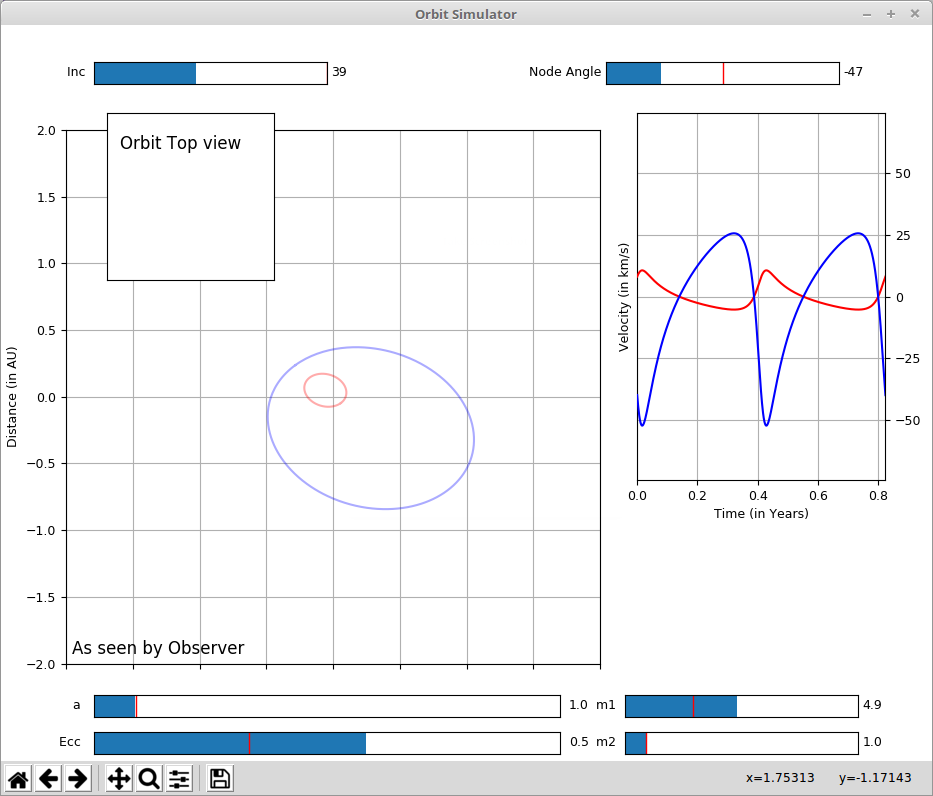

# Keplerian Orbit Laboratory

Cornell astronomy lab on studying Keplerian orbits. Using various sliders to change the parameters of the orbit, students explore what the Keplerian orbits will look like in a wide variety of configurations.

Please note! The GUI is having some difficulties in the latest versions of some of the base packages and will need to be redone. The interface will redraw if you restretch the figure window slightly. Apologies for the inconvenience.

The laboratory worksheet for the Fall 2013 teaching of Astro 1103 (Nature of the Universe) is available [here](2_Orbit.pdf) along with the LaTeX source code so that you can modify at will. 
